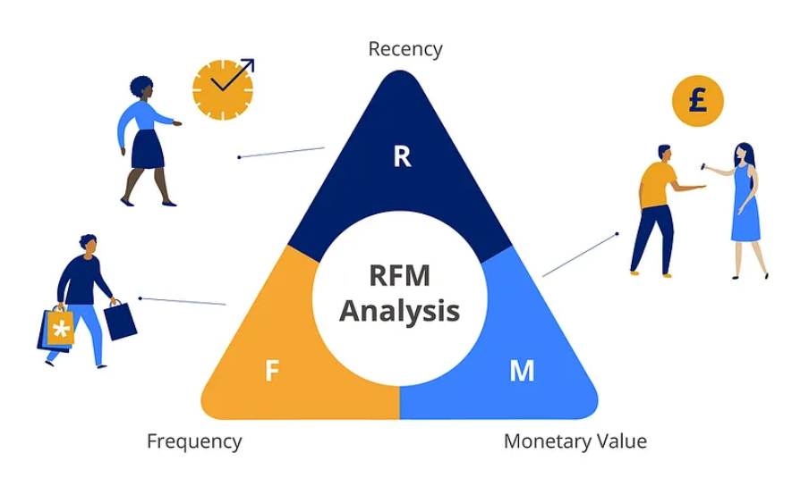

## Project: Customer Segmentation using RFM Analysis for a UK-based Online Retail Store
---

---

### Introduction

This project uses **RFM (Recency, Frequency, and Monetary)** segmentation to analyze customer behavior and provide insights for targeted marketing campaigns. By classifying customers based on their purchasing patterns, strategies can be tailored to improve customer retention, drive growth, and maximize the lifetime value of each customer.

The analysis focuses on transactions from customers in the **United Kingdom** for a UK-based online retail store, with transaction data spanning from **01/12/2010** to **09/12/2011**. The segmentation is based on **positive offer price transactions** for **Recency** and **Frequency**, and **all transactions, including returns**, are used to calculate **Monetary Value**.

---

### Dataset Overview

The dataset used in this analysis contains transactional data from an online retailer in the UK. Each record represents a unique transaction between the company and its customers.

#### Key Variables:

| Variable Name  | Description                                          | Units       |
|----------------|------------------------------------------------------|-------------|
| InvoiceNo      | A unique 6-digit number for each transaction. Cancellations are marked with "C". | -           |
| StockCode      | A 5-digit number uniquely identifying each product.  | -           |
| Description    | The name of the product sold.                        | -           |
| Quantity       | The number of units purchased per transaction.       | Units       |
| InvoiceDate    | The exact date and time of the transaction.          | Date & Time |
| UnitPrice      | The price per unit of each product (in GBP).         | GBP         |
| CustomerID     | A unique 5-digit ID assigned to each customer.       | -           |
| Country        | The customer's country of residence.                | -           |

The data includes a variety of customers, including wholesalers, and spans about a year.

### Data Preprocessing

To prepare the data for RFM analysis, several preprocessing steps were carried out:

1. **Handling Missing Values**: Missing or erroneous values (like canceled transactions) were conditionally filtered out.
2. **Date Parsing**: InvoiceDate was converted to datetime format for recency calculations.
3. **Feature Engineering**: RFM metrics were calculated from the transactional data:
   - **Recency**: The time since the customer's last transaction (based on positive offer price transactions).
   - **Frequency**: The number of transactions made by the customer (based on positive offer price transactions).
   - **Monetary**: The total spending per customer (including returns).

### RFM Analysis

RFM segmentation categorizes customers based on three key metrics:

- **Recency (R)**: Measures how recently a customer made a purchase.
- **Frequency (F)**: Measures how often a customer makes purchases.
- **Monetary (M)**: Measures how much a customer spends (including returns).

The segments are created using thresholds derived from percentiles for each of the three metrics.

### Customer Segmentation and Insights

#### Segmentation and Profiling

Based on RFM analysis, customers are segmented as follows:

- **Super Loyal Churned**: Previously high-value customers who have stopped purchasing.
- **Super Loyal**: High-value customers who frequently purchase and are consistently engaged.
- **Potentially Inactive**: Customers who were frequent buyers in the past but have not made recent purchases, with medium spending.
- **Potential**: Recently active customers with low frequency but high, medium, or low spending potential.
- **New Acquisition**: Newly acquired customers with minimal transactions and high recency.
- **Loyal**: Regular buyers with consistent purchases but lower overall spending compared to other groups.
- **Inactive**: Customers with minimal engagement or no recent purchases.

---

#### Mapping Logic

The following logic maps RFM thresholds (Recency, Frequency, Monetary) to customer segments:

- **H**: High  
- **M**: Medium  
- **L**: Low  

##### Segment Mapping
1. **Super Loyal Churned**  
   - **Conditions**: L-H-H, L-M-H, L-L-H  
   - **Definition**: Customers who spent significantly in the past but recently stopped engaging.

2. **Super Loyal**  
   - **Conditions**: H-H-H, H-M-H, M-H-H, M-M-H  
   - **Definition**: Highly valuable, engaged, and consistent buyers.

3. **Potentially Inactive**  
   - **Conditions**: L-H-M, L-L-M, L-M-M 
   - **Definition**: Customers who were frequent buyers in the past but have not made recent purchases. These customers have medium spending and are at risk of becoming inactive.

4. **Potential**  
   - **Conditions**: M-L-H, M-L-M, M-L-L 
   - **Definition**: Recently active customers with low frequency but high, medium, or low spending potential.

5. **New Acquisition**  
   - **Conditions**: H-L-H, H-L-M, H-L-L  
   - **Definition**: Recently acquired customers with high recency but minimal transactions.

6. **Loyal**  
   - **Conditions**: H-H-L, H-H-M, H-M-L, H-M-M, M-H-L, M-H-M, M-M-L, M-M-M  
   - **Definition**: Consistently engaged buyers with frequent purchases and moderate spending.

7. **Inactive**  
   - **Conditions**: L-H-L, L-L-L, L-M-L  
   - **Definition**: Customers with minimal engagement and low spending.

---

#### Customer Insights and Recommendations

##### Segment Distribution and Strategies:
- **Super Loyal Churned (28.15%)**  
  - **Insights**: Previously high spenders who have recently stopped engaging.  
  - **Recommendation**: Implement win-back strategies like exclusive discounts and personalized offers.

- **Super Loyal (31.58%)**  
  - **Insights**: Highly valuable, engaged, and frequent buyers.  
  - **Recommendation**: Strengthen loyalty with VIP perks, early promotions, and rewards.

- **Potentially Inactive (22.46%)**  
  - **Insights**: At risk of churn, with reduced engagement and medium spending.  
  - **Recommendation**: Use re-engagement campaigns with discounts and personalized promotions.

- **Potential (4.94%)**  
  - **Insights**: Recently active customers with low frequency but high, medium, or low spending potential.  
  - **Recommendation**: Focus on cross-sell and upsell opportunities to increase engagement.

- **New Acquisition (0.64%)**  
  - **Insights**: Recently acquired customers with limited transactions.  
  - **Recommendation**: Run onboarding campaigns with incentives to build loyalty and encourage repeat purchases.

- **Loyal (4.15%)**  
  - **Insights**: Frequent buyers with moderate spending.  
  - **Recommendation**: Encourage higher spending through loyalty programs and personalized incentives.
 
- **Inactive (8.07%)**  
  - **Insights**: Minimal engagement or purchasing activity.  
  - **Recommendation**: Launch reactivation campaigns with deep discounts or targeted offers.

---

This segmentation framework ensures clarity and provides actionable strategies to enhance customer engagement, retention, and value.

### Conclusion

RFM segmentation helps identify distinct customer groups based on their purchasing behaviors, enabling more targeted marketing campaigns. By understanding customer engagement and tailoring strategies for retention, growth, and re-engagement, businesses can maximize the value of each customer. Future steps may include predictive modeling and more refined segmentation for further optimization of marketing efforts.

---

### Project Files and Structure

- **[Customer Segmentation Using RFM Analysis for Online Retail.ipynb](https://github.com/ChaitanyaC22/Customer-Segmentation-Using-RFM-Analysis-for-Online-Retail/blob/main/Customer%20Segmentation%20Using%20RFM%20Analysis%20for%20Online%20Retail.ipynb)**: Contains the complete code for performing the RFM analysis.
- **Dataset folder**: Contains the Online Retail dataset used for analysis.
- **Output_Files folder**: Stores all output files generated from the analysis.
- **RFM Analysis folder**: Contains the final RFM segmentation analysis results and reports.

For more details on the analysis, please refer to the final RFM analysis report:
**[RFM Analysis Detailed Report](./RFM%20Analysis/RFM_Segmentation_Analysis_UKRetailOnline.xlsx?raw=true)**

---

### Acknowledgements

A special thanks to [Siddharth Birajdar](https://in.linkedin.com/in/siddharth-birajdar), whose work inspired much of this analysis.

This dataset is made available by the **UCI Machine Learning Repository** and was created by **Daqing Chen**, School of Engineering, London South Bank University. You can access the dataset [here](https://archive.ics.uci.edu/dataset/352/online+retail).

 
Thank you for taking the time to visit this repository. 🙏

---
